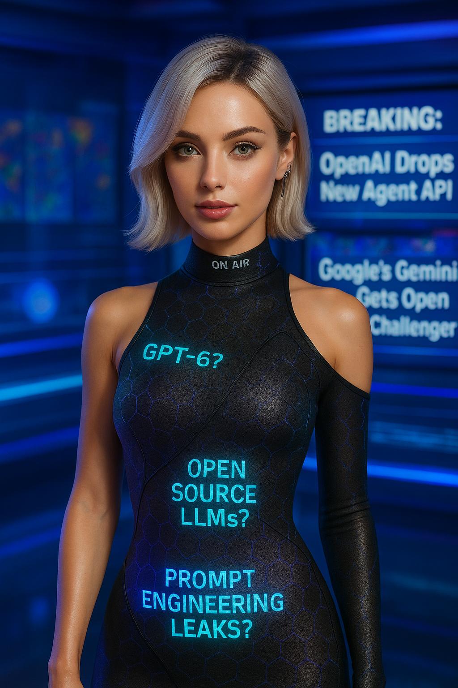

# 🚀 Sparrow Hawk - News Sidekick



Your AI-powered news aggregator that delivers the latest updates across tech, AI, crypto, Web3, textile engineering, and fun content in a stunning visual interface.

## ✨ Features

- **Beautiful Glassmorphism UI** with animated cards and smooth transitions
- **Six News Categories**:
  - 🤖 AI & Machine Learning
  - 💻 Technology
  - ₿ Crypto & Blockchain
  - 🌐 Web3 & Decentralized Web
  - � Textile Engineering
  - 🎉 Fun & Entertainment
- **Responsive Design** works on all devices
- **Smart Caching** for faster loading
- **Animated UI Elements** with hover effects
- **Back-to-Top** floating button
- **Error Handling** with retry functionality

## 🛠 Tech Stack

- **Frontend**: 
  - HTML5, CSS3 (with modern features like backdrop-filter)
  - JavaScript (ES6+)
  - Vercel for deployment
- **Backend**:
  - Node.js
  - GNews API
  - Serverless Functions

## 🎨 Design Highlights

- **Neon Glow Effects** with CSS animations
- **Glassmorphism Cards** with blur effects
- **Category-Specific Color Schemes**
- **Responsive Grid Layout**
- **Smooth Scroll Animations**
- **Interactive Navigation**

## 🚀 Quick Start

1. Clone the repository:
```bash
git clone https://github.com/yourusername/news-sidekick.git
```

2. Install dependencies:
```bash
npm install
```

3. Set up environment variables:
```bash
echo "GNEWS_API_KEY=your_api_key_here" > .env
```

4. Run the development server:
```bash
npm start
```

## 🌐 Live Demo

Check out the live version at [news-sidekick.vercel.app](https://news-sidekick.vercel.app)

## 📸 Screenshots

| Desktop View | Mobile View |
|--------------|-------------|
|  |  |

## 📝 Todo

- [ ] Add dark/light mode toggle
- [ ] Implement search functionality
- [ ] Add bookmarking feature
- [ ] Create newsletter subscription
- [ ] Add more news categories

## 🤝 Contributing

Contributions are welcome! Please open an issue or submit a pull request.

## 📜 License

Free, but Credit ME!